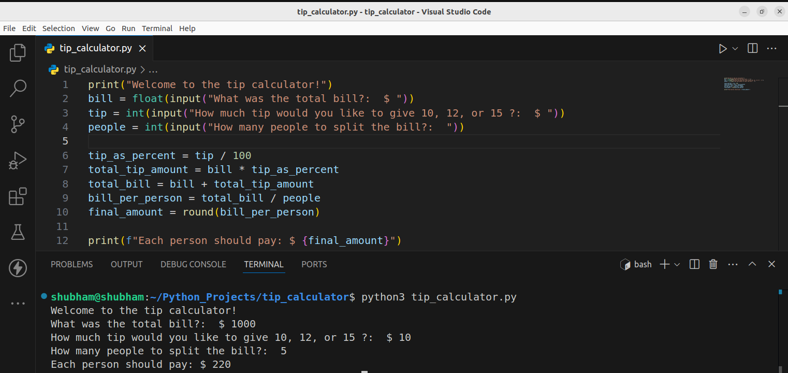

# Tip-calculator-project

## Screenshot

This project is a simple tip calculator built with [Python 3](https://www.python.org/downloads/) that helps users easily calculate the total cost of a meal, including tip. The program prompts the user to enter the bill amount, select a tip percentage, and optionally split the bill among multiple people. It then calculates the tip amount and displays the total cost per person. This project is perfect for practicing basic Python skills like user input, conditional statements, and arithmetic operations.

## 🛠  Description

 Some distributions, in friends provide extra money . A tip for the waiter and calculate the money distribution among friends.
 
 ## ⚙️ Languages or Frameworks Used

You only need Python to run this script. You can visit [here](https://www.python.org/downloads) to download Python.

## 🌟 How to run

+ `python3 tip_calculator.py`

## 📺 Demo

